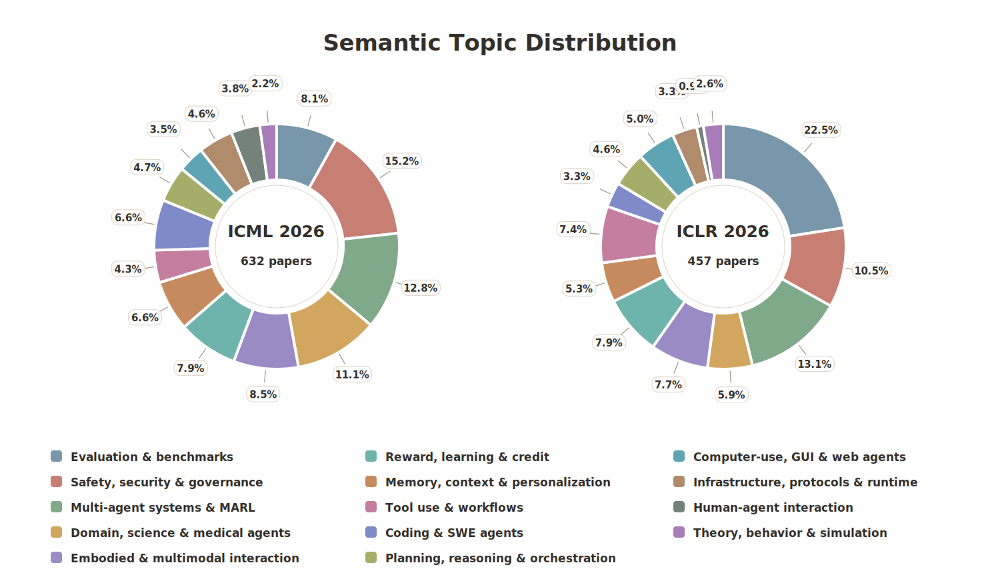

# 🤖 ICML 2026 & ICLR 2026 Agent Papers

🌐 **Language:** English | [中文](./README.zh-CN.md)

> A curated title + official abstract map of agent-related papers from ICML 2026 and ICLR 2026.

- 🗓️ **Last updated:** 2026-06-22
- 📄 **Total coverage:** **1,089** agent papers
- 🧮 **By conference:** **632 ICML 2026** + **457 ICLR 2026**

## 📚 Conference Lists

| Conference | Paper Num | Paper List |
|---|---:|---|
| [ICML 2026](https://icml.cc/virtual/2026/papers.html) | 632 | [English](./conferences/icml-2026.md) / [中文](./conferences/icml-2026.zh-CN.md) |
| [ICLR 2026](https://iclr.cc/virtual/2026/papers.html) | 457 | [English](./conferences/iclr-2026.md) / [中文](./conferences/iclr-2026.zh-CN.md) |

## 🔎 Curation Criteria

Each paper was reviewed from its title and official abstract. We keep papers where agents, tool use, computer use, multi-agent systems, or agentic workflows are central to the contribution, and exclude papers where these terms are only incidental.

## 🏷️ Topic Distribution

Based on each paper's title and official abstract, we assigned a research topic to every curated agent paper. The figure below compares ICML 2026 and ICLR 2026 with a shared topic taxonomy and fixed colors.

