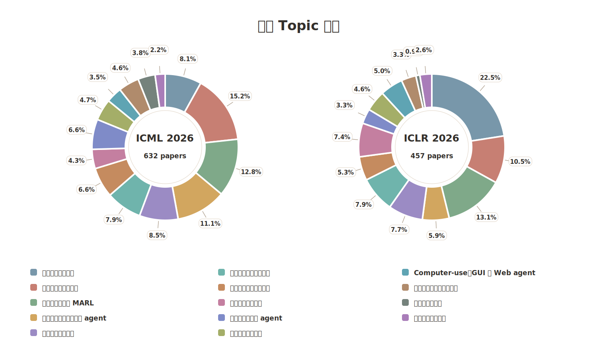

# 🤖 ICML 2026 与 ICLR 2026 Agent Papers

🌐 **语言：** [English](./README.md) | 中文

> 非官方整理：基于 title + 官方 abstract，对 ICML 2026 与 ICLR 2026 中的 agent 相关论文做 core-only 阅读清单。

- 🗓️ **最后更新：** 2026-06-22
- 📄 **总覆盖范围：** **1089** 篇 agent papers
- 🧮 **会议拆分：** **632 篇 ICML 2026** + **457 篇 ICLR 2026**

## 📚 会议清单

| 会议 | 论文数 | 论文清单 |
|---|---:|---|
| [ICML 2026](https://icml.cc/virtual/2026/papers.html) | 632 | [English](./conferences/icml-2026.md) / [中文](./conferences/icml-2026.zh-CN.md) |
| [ICLR 2026](https://iclr.cc/virtual/2026/papers.html) | 457 | [English](./conferences/iclr-2026.md) / [中文](./conferences/iclr-2026.zh-CN.md) |

## 🔎 收录标准

每篇论文都基于标题和官方 abstract 进行审阅。我们收录 agent、tool use、computer use、多智能体系统或 agentic workflow 构成核心贡献的论文；如果这些概念只是顺带出现，则不纳入公开清单。

## 🏷️ Topic 分布

基于每篇论文的标题和官方 abstract，我们为每篇 agent 论文标注了研究 topic。下图是ICML 2026 与 ICLR 2026 的 topic 分布。

